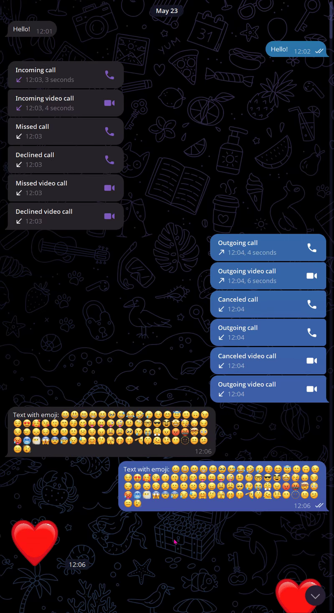
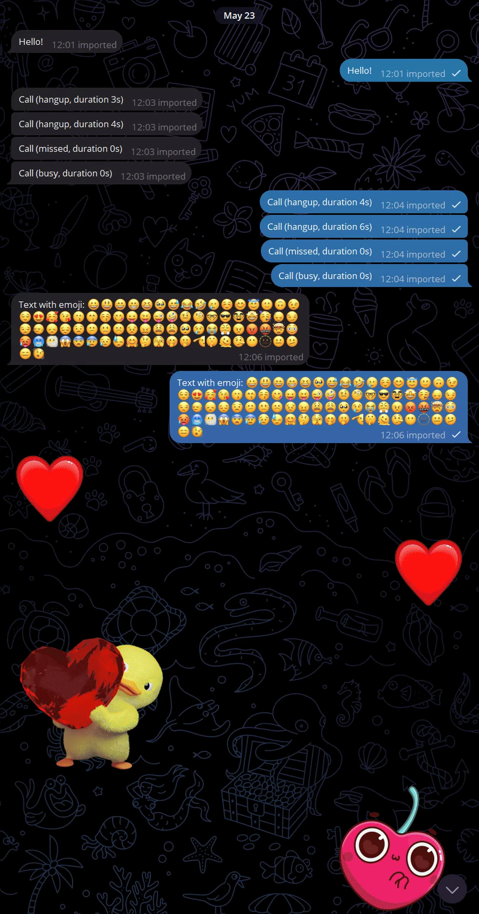

# telegram-import
Conversion of HTML backup to JSON and subsequent import back into Telegram.

<table>
  <tr>
    <td align="center">
      <a href="demo/Original_Optimized.webm">
         
        📤 <b>Оригинал (HTML экспорт)</b>
      </a>
    </td>
    <td align="center">
      <a href="demo/Import_Optimized.webm">
         
        📥 <b>Импортировано в Telegram</b>
      </a>
    </td>
  </tr>
</table>
